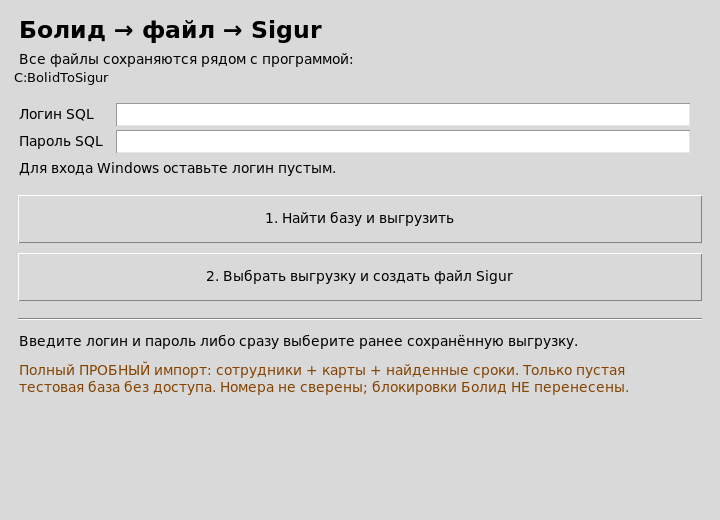

# BolidToSigur — перенос сотрудников и карт с Болид (Орион) на Sigur

**Миграция данных СКУД за две кнопки:** сотрудники, карты Wiegand‑34, сроки действия пропусков, фотографии и кадровые данные — из базы СКУД «Болид» (Орион / Орион Pro) в готовый файл импорта «Sigur» (Excel). Без ручного ввода.

## Задача, которую решает программа

При переезде с СКУД «Болид» на «Sigur» нужно перенести персонал и карты. Официальный способ импорта в Sigur — таблица Excel (Персонал → Импорт из таблицы MS Excel). Но:

- в базе Болид нет экспорта «в файл Sigur»;
- номера карт хранятся в формате CodeP, а Sigur ожидает Wiegand‑34 (8 HEX‑символов);
- у сроков действия пропусков, фотографий и примечаний — свои форматы полей;
- вручную вводить сотни сотрудников и карт нереально.

**BolidToSigur делает это за вас:** находит базу Болид, выгружает данные в промежуточный файл и собирает файл импорта Sigur с сопоставлением полей, расчётом номеров W34, датами и фото.

## Что переносится

| Поле | Болид (исходник) | Sigur (результат) |
|---|---|---|
| ФИО, отдел, должность | карточка сотрудника | карточка сотрудника |
| Табельный номер | карточка сотрудника | табельный номер |
| Номер пропуска | ключ, CodeP → **Wiegand‑34** (8 HEX) | номер пропуска |
| Начало/окончание действия пропуска | поля ключа | даты действия пропуска |
| Фотография | фото сотрудника | файл фотографии |
| Паспорт РФ, прописка | карточка сотрудника | отдельные колонки |
| Примечание | дата рождения | только `Дата рождения: ДД.ММ.ГГГГ` (или пусто) |

- **Сотрудники без ключей тоже включены** в общий файл (отдельный счётчик).
- Несколько карт у сотрудника — строки продолжения по руководству Sigur.
- **Блокировки и статусы Болид не переносятся** — это осознанное решение: права и расписание назначаются в Sigur отдельно.
- Нераспознанные коды/даты и неоднозначные люди — в `Исключения.csv` с причиной: данные не пропадают молча.

## Как это работает — две кнопки

1. **Кнопка 1. «Найти базу и выгрузить»** — вводите логин/пароль SQL (или оставляете логин пустым для входа Windows) → программа сама находит базу Болид (файлы `.bak` не используются) и сохраняет выгрузку сотрудников, ключей и фото в файл `.bolid` рядом с программой.
2. **Кнопка 2. «Выбрать выгрузку и создать файл Sigur»** — выбираете `.bolid` → получаете папку `Для_Sigur_дата/` с XLS для импорта, отчётами и исключениями. **Для этого шага SQL повторно не нужен.**

Вся обработка — локально на вашей машине, данные никуда не отправляются.

## Требования

- Windows 10/11, Python 3.10+ (Tkinter входит в поставку).
- Для **кнопки 1** (выгрузка из базы Болид): `pyodbc` + Microsoft ODBC Driver 17/18 for SQL Server (драйвер ставится отдельно).
- **Кнопка 2** работает без ODBC — нужны только `xlwt`, `xlrd`, `Pillow`.

## Быстрый старт

1. Скачайте архив [BolidToSigur_v1.0.0.zip](https://github.com/tommy-fire/BolidToSigur/releases) из [Releases](https://github.com/tommy-fire/BolidToSigur/releases).
2. Создайте папку `C:\BolidToSigur`, распакуйте в неё содержимое архива, откройте `ЗАПУСК.bat`.
3. Кнопка 1 — логин/пароль, дождитесь выгрузки `.bolid`.
4. Кнопка 2 — выберите `.bolid`, откройте готовый XLS и импортируйте в Sigur: Персонал → Импорт из таблицы MS Excel. Сопоставление полей расписано в окне программы и в [01_ПЕРЕНОС.md](01_ПЕРЕНОС.md).

## Безопасность

- **Только чтение** базы Болид: SELECT‑запросы, исходные данные не изменяются.
- Файл `.bolid` не зашифрован и содержит персональные данные — храните его только у себя, не коммитьте в Git.
- Отчёт `ДИАГНОСТИКА_СТРУКТУРЫ.json` — только имена полей и счётчики, **без значений персональных данных**.
- Импорт — только в пустую изолированную тестовую базу Sigur; перед включением в работу сверьте несколько реальных карт со считывателем.

## Проверка

- 54 офлайн‑теста + GUI‑тесты на настоящем Tk (папка `tests/`).
- **v1.0.0 проверена на реальном объекте:** полный перенос сотрудников, карт W34 и сроков выполнен, система работает.

## Структура репозитория

- `ИНСТРУКЦИЯ/` — программа и инструкция пользователя.
- `research/` — источники: руководство Sigur (User Guide) и заметки по формату карт W34.
- `tests/` — тесты.
- `img/` — скриншоты.

## Ограничения

- Номера карт — вычисленные кандидаты: CodeP Болид → Wiegand‑34 (гипотеза raw08‑dallas01‑low32, CRC проверяется). На данном объекте корректность подтверждена эксплуатацией; для другой базы сначала сверьте несколько реальных карт со считывателем.
- Поля дат выбираются автоматически и указываются в отчёте — сверьте их смысл с карточкой Болид.
- Пустая дата окончания может дать бессрочный пропуск в Sigur; пустая дата начала — время импорта. Отчёт показывает такие случаи.

## FAQ

**База Болид будет изменена?** Нет, доступ только на чтение.
**Можно пересобрать файл Sigur без повторного подключения к базе?** Да, кнопка 2 работает по существующему `.bolid`.
**Что если у карт нет дат?** Оставляется пустая ячейка, а не выдуманная дата; количество таких случаев видно в отчёте.
**Почему часть сотрудников не перенеслась?** Смотрите `Исключения.csv` — для каждой исходной записи указана причина.
**Куда отправляются данные?** Никуда: программа работает локально и не имеет сетевых обращений к сторонним сервисам.

## English summary

A two‑button Windows tool for migrating employee data from a Bolid Orion access‑control database (SQL Server) to a Sigur Excel import file: staff, Wiegand‑34 card numbers (from Bolid CodeP), pass validity dates, photos and HR fields. Read‑only source access, fully local processing, exclusion reports, 54 offline tests, verified in production. Details in the Russian README and `01_ПЕРЕНОС.md`.

## Лицензия

[MIT](LICENSE) — пользуйтесь, дорабатывайте, перераспределяйте. Перед переключением сделайте резервные копии обеих систем.
